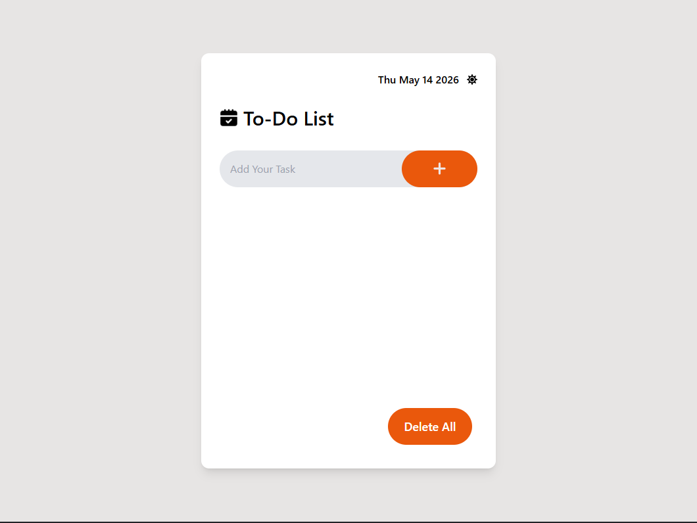
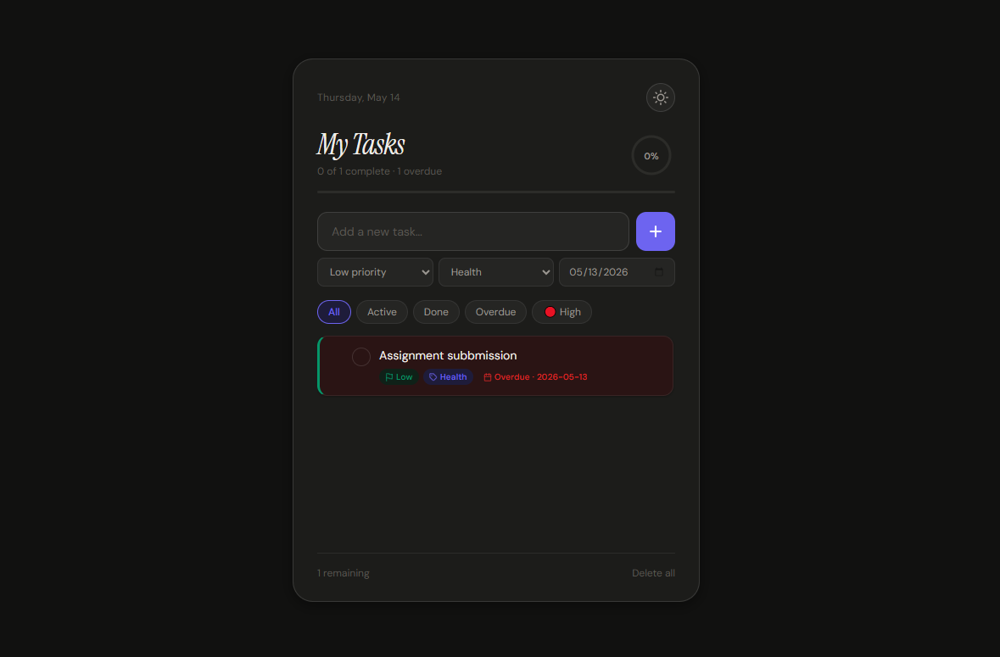

# 🚀 TaskFlow Pro

> A modern, feature-rich, responsive Todo Web Application built with React.js featuring task priorities, categories, drag & drop, progress tracking, dark mode, due dates, and LocalStorage persistence.

[](https://your-live-demo-link.netlify.app)
[](https://reactjs.org)
[](https://developer.mozilla.org/en-US/docs/Web/CSS)
[](https://developer.mozilla.org/en-US/docs/Web/API/Window/localStorage)

---

# 📸 Screenshots

| Light Theme | Dark Theme |
|---|---|
|  |  |

---

# 🚀 Live Demo

🔗 **[https://alitask.netlify.app](https://alitask.netlify.app)**

---

# ✨ Features

## ✅ Task Management

- Add new tasks instantly
- Edit existing tasks inline
- Delete individual tasks
- Delete all tasks
- Clear completed tasks
- Mark tasks as completed
- Real-time task updates

---

## 🎯 Priority System

Tasks support:

- 🔴 High Priority
- 🟡 Medium Priority
- 🟢 Low Priority

Each priority includes custom styling and indicators.

---

## 📂 Categories

Organize tasks using categories:

- Work
- Personal
- Health
- Finance
- Study

---

## 📅 Due Dates & Overdue Detection

- Assign due dates to tasks
- Automatically detects overdue tasks
- Highlights overdue items visually

---

## 🌙 Theme Support

- Light Theme
- Dark Theme
- Theme persistence using LocalStorage

---

## 📊 Progress Tracking

- Circular animated progress ring
- Dynamic progress bar
- Completion percentage calculation
- Remaining tasks counter

---

## 🎉 Celebration Animation

When all tasks are completed:

- Celebration overlay appears
- Animated success feedback

---

## 🔄 Drag & Drop Reordering

- Reorder tasks using drag & drop
- Smooth visual feedback while dragging

---

## 🔍 Smart Filters

Filter tasks by:

- All
- Active
- Completed
- Overdue
- High Priority

---

## 💾 LocalStorage Persistence

All data is stored locally in browser storage.

This includes:

- Tasks
- Theme preferences
- Completion state
- Order of tasks

No backend/database required.

---

## ⌨️ Keyboard Shortcuts

| Key | Action |
|---|---|
| Enter | Add task |
| Delete | Remove completed tasks |
| Escape | Cancel editing |

---

## 📱 Fully Responsive

Optimized for:

- Mobile devices
- Tablets
- Laptops
- Large desktop screens

---

# 🛠️ Tech Stack

## Frontend

| Technology | Purpose |
|---|---|
| React.js 18 | UI Framework |
| React Hooks | State Management |
| React Icons | Icon Library |
| CSS3 | Styling & Animations |
| LocalStorage API | Persistent Storage |

---

# 📁 Project Structure

```bash
todo-app/
├── public/
│
├── src/
│   ├── components/
│   │   ├── Todo.jsx
│   │   ├── todo.css
│   │   └── ...
│   │
│   ├── App.jsx
│   ├── main.jsx
│   └── index.css
│
├── screenshots/│  
│   ├── dark.png│ 
│   └── light.png
│
├── package.json
└── README.md
```

---

# ⚙️ Getting Started

## Prerequisites

- Node.js 18+
- npm or yarn

---

# 📥 Installation

```bash
# 1. Clone repository
git clone https://github.com/yourusername/todo-app.git

# 2. Navigate to project
cd todo-app

# 3. Install dependencies
npm install

# 4. Start development server
npm run dev
```

Application runs at:

```bash
http://localhost:5173
```

---

# 🧠 Core Functionalities

## ➕ Add Tasks

```js
setTasks(prev => [
  {
    id: Date.now(),
    text,
    priority,
    category,
    due,
    isComplete: false,
  },
  ...prev
])
```

---

## ✔️ Complete Tasks

```js
setTasks(prev =>
  prev.map(t =>
    t.id === id
      ? { ...t, isComplete: !t.isComplete }
      : t
  )
)
```

---

## ✏️ Inline Editing

Users can edit tasks directly without opening modals.

---

## 🔄 Drag & Drop

Tasks can be reordered dynamically using drag-and-drop functionality.

---

## 📊 Progress Calculation

```js
const pct = total
  ? Math.round((done / total) * 100)
  : 0
```

---

## 💾 LocalStorage Persistence

```js
localStorage.setItem(
  'ReactTaskV2',
  JSON.stringify(tasks)
)
```

---

# 🎨 Theme System

Uses CSS custom properties for dynamic theming.

## Example Variables

```css
--bg-color
--card-bg
--text-color
--primary-color
--danger-color
--border-color
```

---

# 📱 Responsive Design

| Device | Layout |
|---|---|
| Mobile | Compact stacked layout |
| Tablet | Balanced centered UI |
| Desktop | Full modern dashboard |
| Large Screens | Spacious responsive design |

---

# 🚀 Deployment

## Netlify Deployment

```bash
npm run build
```

Upload the generated `dist` folder to Netlify  
or connect GitHub repository for automatic deployment.

---

# 🤝 Contributing

Contributions are welcome!

```bash
1. Fork the repository
2. Create your feature branch
3. Commit your changes
4. Push to the branch
5. Open a Pull Request
```

---

# 👨‍💻 Author

## Ali Hassan

- GitHub: [@rkhassan420](https://github.com/rkhassan420)
- LinkedIn: [linkedin.com/in/ali-hassan-dev01](https://www.linkedin.com/in/ali-hassan-dev01/)
- Portfolio: [https://showcraft.netlify.app/portfolio/ali11243](https://showcraft.netlify.app/portfolio/ali11243)

---

# ⭐ Support

If you like this project:

- Give it a ⭐ on GitHub
- Share it with others
- Fork and contribute

---

# ❤️ Acknowledgements

Built with React.js and modern frontend practices to create a beautiful productivity experience.

---

<p align="center">
  Made with ❤️ by Ali Hassan
</p>
